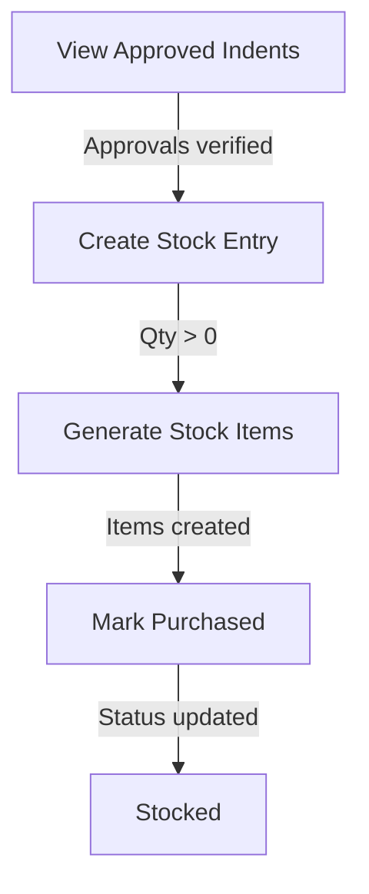

## Purchase & Store Module (WF-PS-001)

Django + DRF backend + React frontend implementing:
- **Indent submission** by authenticated employee
- **Stock check** against `CurrentStock`
- **Department routing** to the correct HOD via `HoldsDesignation`
- **Strict RBAC** using an acting role header (`X-Acting-Role`)

### Backend (Django)

Create env file:
- Copy `backend/.env.example` to `backend/.env`
- If you don’t set `POSTGRES_DB`, it will fall back to SQLite (`backend/db.sqlite3`)

Run:

```bash
cd backend
..\.venv\Scripts\python manage.py migrate
..\.venv\Scripts\python manage.py seed_demo
..\.venv\Scripts\python manage.py createsuperuser
..\.venv\Scripts\python manage.py runserver
```

Auth:
- Get JWT: `POST /ps/api/auth/token/`
- Use: `Authorization: Bearer <access>`

### Frontend (React)

```bash
cd frontend
npm install
npm run dev
```

Optional env:
- Create `frontend/.env` with:

```bash
VITE_API_BASE=http://127.0.0.1:8000
```

### RBAC (acting role)

All `/ps/api/*` endpoints require:
- JWT auth
- `X-Acting-Role: EMPLOYEE` or `X-Acting-Role: HOD`

Server-side checks:
- **EMPLOYEE**: can create indents and view only their own
- **HOD**: must have an active `HoldsDesignation` whose `designation.name` contains `hod`; can view only department indents and take actions

### Key endpoints

- `POST /ps/api/indents/` (EMPLOYEE) submit indent (auto-assign indenter + department, stock check, route to HOD)
- `GET /ps/api/indents/` (EMPLOYEE/HOD) list indents (RBAC filtered)
- `POST /ps/api/indents/{id}/hod-action/` (HOD) approve/reject/forward

# 📦 Approved Procurement Conversion to Inventory

## 🆔 Workflow Details

* **Workflow Code:** WF-PS-002
* **Workflow Name:** Approved Procurement Conversion to Inventory

---

## 🎯 Objective

Convert approved procurement requests into inventory stock records.

---

## ⚡ Trigger

This workflow is triggered when an **Admin initiates stock entry**.

---

## 👥 Actors / Lanes

* **Dept Admin**
* **PS Admin**
* **System**

---

## ✅ Preconditions

Before starting the workflow:

* All approvals must be completed
* Items must not be marked as purchased

---

## 🚀 Start Task

* **UC-007: Stock Entry**

---

## 🔄 Workflow Overview

### 🧩 Activity Graph – Nodes

| Node ID | Type   | Label                 | Actor/Lane | Notes     |
| ------- | ------ | --------------------- | ---------- | --------- |
| N1      | UC     | View Approved Indents | Admin      | UC-005    |
| N2      | UC     | Create Stock Entry    | Admin      | UC-007    |
| N3      | System | Generate Stock Items  | System     | BR-7      |
| N4      | System | Mark Purchased        | System     | BR-6      |
| END     | End    | Stocked               | —          | Completed |

---

### 🔁 Directed Edges

| Edge ID | From | To  | Condition          | Outcome         |
| ------- | ---- | --- | ------------------ | --------------- |
| E1      | N1   | N2  | Approvals verified | Allow entry     |
| E2      | N2   | N3  | Qty > 0            | Generate units  |
| E3      | N3   | N4  | Items created      | Mark purchased  |
| E4      | N4   | END | Status updated     | Workflow closed |

---

## 📊 Workflow Diagram (Mermaid)



---

## 🧠 Business Rules

* **BR-6:** Items must be marked as purchased after stock generation
* **BR-7:** Stock items should be generated based on entered quantity

---

## 🛠️ Notes

* Ensures procurement lifecycle completion
* Prevents duplicate purchases
* Maintains accurate inventory records

---

```
